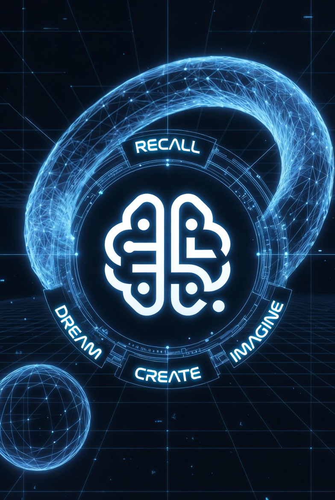

#  AQL — Agent Query Language

[](AQL_spec_v2.md)
[](LICENSE)
[](AQL_spec_v2.md)

> *"NQL speaks to those who read. NAQ speaks to those who calculate. **AQL speaks to those who think.**"*


---

## The SQL of Cognitive Agents

**AQL (Agent Query Language)** is the cognitive intent language of **NietzscheDB**. It is the highest layer of the NietzscheDB query stack — designed for AI agents to interact with hyperbolic memory graphs using cognitive intentions, not database instructions.

```
┌─────────────────────────────────────┐
│         Humano / Dev                │
│         NQL (legivel, graph query)  │
├─────────────────────────────────────┤
│         Agente LLM (precisao)       │
│         NAQ (builder API, compact)  │
├─────────────────────────────────────┤
│         Agente LLM (cognicao)       │
│         AQL (cognitive intents)     │
└─────────────────────────────────────┘
            │
            ▼
      NietzscheDB Server
      (gRPC :50051 / HTTP :8080)
```

### The Three Axioms
1. **Intention as Primitive** — The atomic unit is a cognitive act, not a database instruction.
2. **Uncertainty as Data Type** — `CONFIDENCE 0.7` is an epistemic statement, not a filter threshold.
3. **Effects as Automatic Consequences** — The agent declares intent; the server applies side-effects (Energy, Decay, Association).

---

## Two Execution Paths

AQL runs in two complementary ways inside NietzscheDB:

### 1. Server-side (gRPC `ExecuteAql`)

The NietzscheDB server has a native `ExecuteAql` gRPC endpoint that parses and executes AQL statements directly. One gRPC call, one roundtrip, everything happens inside the server:

```
Agent → gRPC ExecuteAql("RECALL \"quantum\" LIMIT 5") → NietzscheDB server
                                                            ├── parse verb
                                                            ├── Full-Text + KNN
                                                            ├── side-effects (energy boost)
                                                            └── return AqlCognitiveNode (protobuf)
```

**Supported verbs (server-side):** `RECALL`, `IMPRINT`, `ASSOCIATE`, `TRACE`, `RESONATE`, `DISTILL`, `FADE`, `DREAM` + NQL fallback for unknown verbs.

Proto definition (`nietzsche.proto`):
```protobuf
rpc ExecuteAql (AqlRequest) returns (AqlResponse);

message AqlRequest {
  string collection    = 1;
  string aql_statement = 2;
  map<string, bytes> context = 3;
}

message AqlResponse {
  string status              = 1;
  string error               = 2;
  repeated AqlCognitiveNode nodes = 3;
  repeated AqlCognitiveEdge edges = 4;
  AqlResultMetadata metadata = 5;
  string execution_plan      = 6;
}
```

### 2. Client-side (`aql-core` + `aql-nietzschedb`)

The `aql-core` crate provides a full parser (Pest PEG), cognitive planner, and async executor. The `aql-nietzschedb` crate lowers AQL plans into gRPC calls via the `AqlBackend` trait:

```
AQL string → Parser (Pest PEG) → AST → CognitivePlanner → ExecutionPlan
    → Lowering (NaqInstruction) → gRPC calls → CognitiveResult
```

This path adds: parallel execution (`AND`), chaining (`THEN`), conditionals (`WHEN`/`ELSE`), atomic blocks, mood-based planning, and WorkingMemory between steps.

**All 13 verbs implemented with real gRPC calls** — not placeholders.

---

## The 13 Cognitive Verbs

| Category | Verb | NietzscheDB Operation |
|:---|:---|:---|
| **Core** | `RECALL` | Full-Text Search + KNN |
| | `RESONATE` | FTS seed → BFS diffusion |
| | `REFLECT` | PageRank (central knowledge) |
| | `TRACE` | BFS / Dijkstra traversal |
| | `IMPRINT` | InsertNode + optional InsertEdge |
| | `ASSOCIATE` | InsertEdge (Association) |
| | `DISTILL` | PageRank (extract influential patterns) |
| | `FADE` | UpdateEnergy / DeleteNode (energy depletion) |
| **Geometric** | `DESCEND` | FTS + magnitude filter (deeper in Poincare ball) |
| | `ASCEND` | FTS + magnitude filter (toward abstractions) |
| | `ORBIT` | FTS + magnitude filter (same depth peers) |
| **Altered States** | `DREAM` | SleepCycle (Hausdorff perturbation, Adam optimization) |
| | `IMAGINE` | FTS premise search (counterfactual reasoning) |

---

## Quick Start

```aql
# Recall with epistemic confidence
RECALL "quantum physics" CONFIDENCE 0.8

# Semantic resonance with emotional mood
RESONATE "consciousness emerges from complexity" MOOD creative

# Parallel execution with result chaining
RECALL "machine learning" AND RECALL "neuroscience"
THEN ASSOCIATE @results[0] LINKING @results[1] CONFIDENCE 0.9

# Navigate hyperbolic hierarchy
DESCEND "physics" DEPTH 3 MAGNITUDE 0.3..0.7

# Write knowledge with affective dimensions
IMPRINT "eureka moment!" VALENCE positive AROUSAL high AS Belief

# Creative dream cycle
DREAM ABOUT "quantum consciousness"

# Intentional forgetting (reduces energy, deletes if depleted)
FADE <node-uuid> BY 0.1
```

---

## Epistemic Type System

Every `IMPRINT` or `RECALL` operation respects the **Epistemic Type**:

| Type | Decay | Initial Energy | NietzscheDB NodeType |
|:---|:---|:---|:---|
| `Belief` | Slow (0.001) | 0.6 | Semantic |
| `Experience` | Medium (0.005) | 0.5 | Episodic |
| `Pattern` | Very slow (0.0005) | 0.8 | Semantic |
| `Signal` | Fast (0.05) | 0.3 | Semantic |
| `Intention` | None until completion | 0.7 | Concept |

---

## Workspace Crates

| Crate | Purpose | Status |
|:---|:---|:---|
| `aql-core` | Parser (Pest PEG), AST, Planner, Executor | Complete |
| `aql-nietzschedb` | NietzscheDB backend (gRPC, hyperbolic geometry) | Complete |
| `aql-sqlite` | Embedded cognitive store (FTS5, recursive CTEs) | SQL generation |
| `aql-mssql` | Enterprise cognitive store (FREETEXT, graph MATCH) | SQL generation |
| `aql-neo4j` | Graph-native backend (Cypher lowering) | Lowering |
| `aql-qdrant` | Vector-native backend (Hybrid search) | Lowering |
| `aql-pgvector` | Relational + Vector backend (PostgreSQL) | Lowering |
| `aql-redis` | High-speed cache backend | Lowering |
| `aql-mysql` | MySQL backend | Lowering |
| `aql-cli` | Interactive REPL | Complete |
| `aql-wasm` | Browser/Edge execution | Scaffold |
| `aql-python` | Python SDK (PyO3) | Scaffold |

---

## Side Effects (Automatic)

Each verb triggers implicit side-effects — the agent never manages these manually:

| Verb | Side-Effects |
|:---|:---|
| `RECALL` | BoostAccessedNodes, CreateTemporalEdge, RecordAccessPattern |
| `RESONATE` | BoostAccessedNodes, RecordResonancePattern |
| `TRACE` | BoostPathNodes, CreateTemporalEdge |
| `IMPRINT` | AssociateToSessionContext, BoostLinkedNodes |
| `ASSOCIATE` | CreateTemporalEdge, BoostLinkedNodes |
| `DISTILL` | CreatePatternNode, LinkSourceEpisodes |
| `FADE` | RecordFadeEvent |
| `DREAM` | CreatePatternNode, BoostAccessedNodes |

---

## Build & Development

```bash
# Build the entire workspace
cargo build --workspace

# Run complete test suite
cargo test --workspace

# Run the CLI REPL
cargo run -p aql-cli
```

---

## NietzscheDB Query Stack

| Layer | Language | For | Example |
|:---|:---|:---|:---|
| Low | **gRPC** | Direct API calls | `InsertNode`, `KnnSearch`, `BFS` |
| Mid | **NQL** | Human devs, graph queries | `MATCH (n:Semantic) WHERE n.energy > 0.5 RETURN n` |
| Mid | **NAQ** | Rust internals, cached ASTs | `Naq::match_nodes().where_gt("energy", 0.5).build()` |
| High | **AQL** | AI agents, cognitive intent | `RECALL "quantum" CONFIDENCE 0.8 MOOD creative` |

---

## License & Author

**Author:** Jose R F Junior
**License:** AGPL-3.0

*"Are you trying to make AGI with boring tables and vectors? I'm going to do it with dynamite and curved geometry."*
